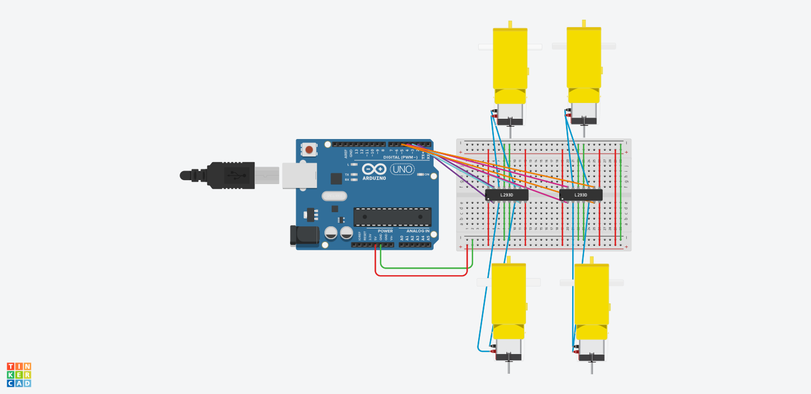

# 4 DC Motors Control Using Arduino and L293D

This project demonstrates how to control **4 DC motors** using an **Arduino Uno** and **two L293D motor driver ICs** in Tinkercad.

## Project Objective

The motors perform the following movement sequence:

1. Move forward for **30 seconds**
2. Move backward for **60 seconds**
3. Turn right and left alternately for **60 seconds**
4. Stop after completing the sequence

## Components

* Arduino Uno R3
* 2 × L293D Motor Driver ICs
* 4 × DC Motors
* Breadboard
* Jumper Wires

## Arduino Pins

* D2 and D3 → Left-side motors
* D4 and D5 → Right-side motors

## Motor Driver Connections

## Circut Diagram


### Left L293D

* IN1 and IN4 → Arduino D2
* IN2 and IN3 → Arduino D3

### Right L293D

* IN1 and IN4 → Arduino D4
* IN2 and IN3 → Arduino D5

The Enable pins are connected to **5V** to activate the motor drivers.

## Movement Sequence

```text
Forward  → 30 seconds
Backward → 60 seconds
Right/Left alternately → 60 seconds
Stop
```

## Simulation

The circuit was designed and tested using **Tinkercad Circuits**.

https://www.tinkercad.com/things/4X7wCVzgdaI-four-dc-motors-l293d


